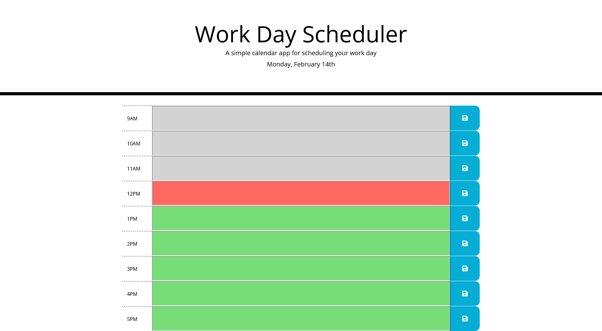

# Work Day Scheduler
### This is a simple calendar application that allows a user to save events for each hour of the day(ONLY business hours). This app will run in the browser.
<br/>

## **What is the User Story?**
```
AS AN employee with a busy schedule
I WANT to add important events to a daily planner
SO THAT I can manage my time effectively
```
<br/>

## **What has been coded?**
* HTML - made a jumbotron and time-blocks.
* CSS - Used Bootstrap and custom CSS.
* JS - Used JQuery, Moment.js & local storage concepts.
<br/>

<br/>

## **Work Day Scheduler Page**


<br/>

### Click [here](https://nevan-dsouza.github.io/scheduler/) to view the page
<br/>